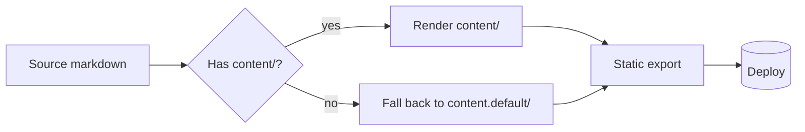
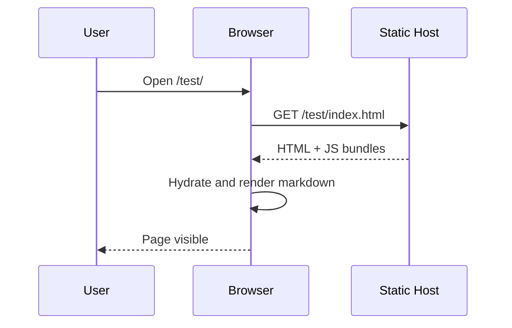
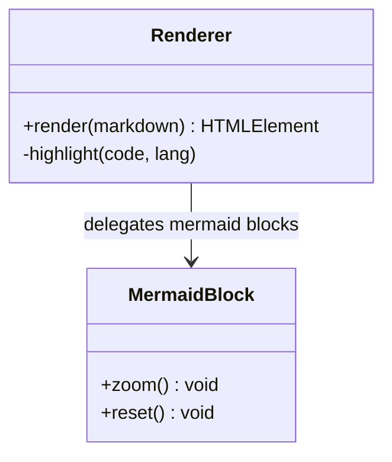
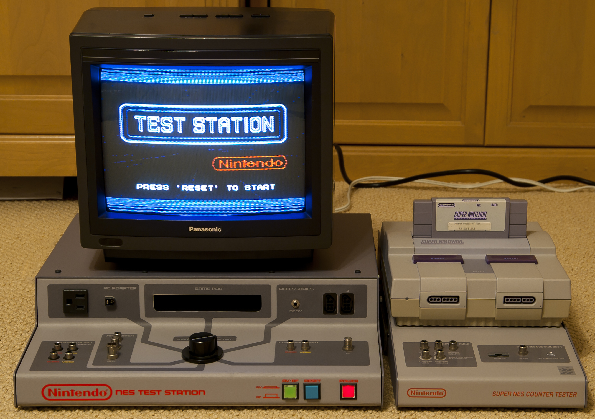

# Rendering Showcase

This page exercises every rendering feature supported by the viewer.
It lives in a subdirectory to also verify nested routing and downloads.

---

## Text Formatting

Plain paragraph with **bold**, *italic*, ***bold italic***, ~~strikethrough~~,
`inline code`, and a [link to the home page](../index.md).

> Block quotes can span multiple lines and contain **formatting**,
> `code`, and even nested quotes.
>
> > Nested quote level two.

## Lists

Unordered:

- First item
- Second item
  - Nested item with `inline code`
  - Another nested item
- Third item

Ordered:

1. Plan the work
2. Work the plan
3. Ship it

Task list:

- [x] Render headings
- [x] Render code blocks
- [ ] Add more diagrams
- [ ] Profit

## Tables

| Feature           | Status     | Notes                          |
| ----------------- | ---------- | ------------------------------ |
| Headings          | Working    | H1 through H6                  |
| Syntax highlight  | Working    | GitHub-style tokens            |
| Mermaid           | Working    | With zoom overlay              |
| KaTeX             | Working    | Inline and display equations   |
| Nested routes     | Working    | This page is at `/test/`       |

Alignment:

| Left | Center | Right |
| :--- | :----: | ----: |
| a    | b      | c     |
| ddd  | eee    | fff   |

## Code Blocks

Python:

```python
def fibonacci(limit: int) -> list[int]:
    """Return Fibonacci numbers strictly less than `limit`."""
    seq = [0, 1]
    while seq[-1] + seq[-2] < limit:
        seq.append(seq[-1] + seq[-2])
    return seq


if __name__ == "__main__":
    print(fibonacci(100))
```

JavaScript:

```javascript
const greet = (name = "world") => `Hello, ${name}!`;

async function fetchUsers() {
  const res = await fetch("/api/users");
  if (!res.ok) throw new Error(`HTTP ${res.status}`);
  return res.json();
}
```

C:

```c
#include <stdio.h>

int main(void) {
    for (int i = 0; i < 3; ++i) {
        printf("iteration %d\n", i);
    }
    return 0;
}
```

Bash:

```bash
# Build and post-process the static export
npm run build
ls out/downloads/
```

JSON:

```json
{
  "name": "showcase",
  "features": ["markdown", "mermaid", "katex"],
  "enabled": true
}
```

Plain (no language):

```
no syntax highlighting here — just preformatted text
    indentation is preserved
```

## Math

Inline math: the Pythagorean identity is $\sin^2\theta + \cos^2\theta = 1$.

Display math:

$$
\int_{-\infty}^{\infty} e^{-x^2}\, dx = \sqrt{\pi}
$$

A matrix:

$$
A = \begin{bmatrix}
1 & 2 & 3 \\
4 & 5 & 6 \\
7 & 8 & 9
\end{bmatrix}
$$

## Mermaid Diagrams

Flowchart:



Sequence diagram:



Class diagram:



## Images



*Image: "NES Test Station & SNES Counter Tester" by
[Realfintogive](https://commons.wikimedia.org/wiki/File:NES_Test_Station_%26_SNES_Counter_Tester_20140112.jpg),
licensed under [CC BY-SA 3.0](https://creativecommons.org/licenses/by-sa/3.0/).
No changes were made.*

## Horizontal Rule

Above the rule.

---

Below the rule.

## Footnotes

Markdown can include footnotes[^1] for citations or asides[^note].

[^1]: This is the first footnote.
[^note]: Named footnotes work too.

## Long Paragraph

Lorem-free filler intentionally avoided. This paragraph exists to verify line
wrapping, justification, and reading width on both desktop and mobile widths.
It contains a few **bold** words, a touch of *italic*, a small bit of `code`,
and a [link back home](../index.md) so the reader can navigate away easily.

## End

If everything above renders cleanly — including the Mermaid toolbar, the
centered display equations, the GitHub-style code highlighting, and the
working subdirectory link — the viewer is healthy.
